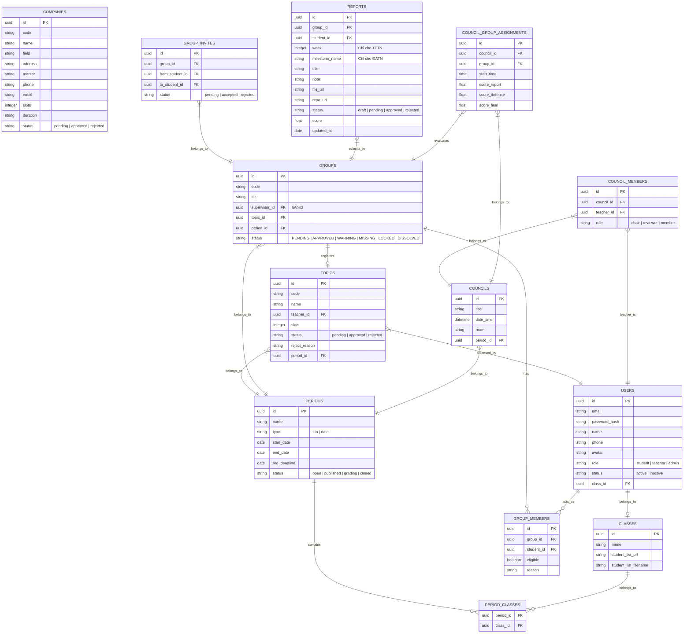

# Đặc Tả Các Module Backend & Thiết Kế API — Graduation Manager (KHPT)

Dựa trên cấu trúc giao diện người dùng (UI) hiện tại của cả hai phân hệ **Admin/Faculty Portal** (Vite + React) và **Student/Teacher Portal** (Next.js), tài liệu này phân loại các API rõ ràng theo từng phân hệ người dùng để đội ngũ Backend dễ dàng triển khai.

---

## 1. Tổng Quan Hệ Thống & Phân Quyền (Roles)

Hệ thống quản lý hai luồng quy trình chính: **Thực tập tốt nghiệp (TTTN)** và **Đồ án tốt nghiệp (ĐATN)**. Hệ thống gồm 3 nhóm người dùng chính:
1. **Admin (Khoa/Ban quản lý)**: Quản trị hệ thống, thiết lập đợt đăng ký (Periods), phê duyệt đề tài, phân công giáo viên hướng dẫn (GVHD), thành lập hội đồng chấm, quản lý tài khoản và thống kê.
2. **Teacher (Giảng viên)**: Đề xuất đề tài, duyệt nhóm đăng ký đề tài của mình, đánh giá báo cáo tuần của SV thực tập, chấm điểm hướng dẫn/phản biện/hội đồng.
3. **Student (Sinh viên)**: Đăng ký đề tài, mời thành viên lập nhóm, khai báo thông tin nơi thực tập ngoài danh sách, nộp báo cáo tuần (TTTN) hoặc báo cáo chương (ĐATN), xem kết quả điểm số.

---

## 2. Thiết Kế Cơ Sở Dữ Liệu Gợi Ý (Database Models)

Để phục vụ tốt các chức năng trên UI, Backend cần thiết kế các bảng (Tables/Entities) sau:

---

## 3. Đặc Tả Chi Tiết API Endpoints Theo Phân Hệ (Portals)

### 🔓 Phân Hệ Chung (Dành Cho Mọi Đối Tượng)
Các API liên quan đến xác thực và các tiện ích dùng chung.
* **Authentication**:
  * `POST /api/dang-nhap-gia-lap`: Đăng nhập hệ thống (trả về `accessToken`, `refreshToken`, và thông tin user kèm `role`).
  * `POST /api/dang-xuat`: Đăng xuất (hủy refresh token).
  * `POST /api/lam-moi-token`: Refresh access token từ refresh token.
* **Upload**:
  * `POST /private/v1/upload`: Tải tệp lên hệ thống (báo cáo, danh sách sinh viên Excel).

---

### 🛡️ Phân Hệ Admin (Admin/Faculty Portal)
Các API này chủ yếu được gọi từ ứng dụng Admin (Vite + React) để quản lý dữ liệu hệ thống.

1. **Quản Lý Sinh Viên & Giảng Viên (Users)**:
   * `GET /api/admin/sinh-vien`: Lấy danh sách người dùng (hỗ trợ phân trang, tìm kiếm theo tên/MSSV, lọc theo `role`, `status`, `class`).
   * `GET /api/admin/sinh-vien/:id`: Lấy chi tiết thông tin người dùng.
   * `POST /api/admin/sinh-vien`: Tạo mới người dùng (SV/GV).
   * `PATCH /api/admin/sinh-vien/:id`: Cập nhật thông tin (email, name, sđt, trạng thái hoạt động).
   * `DELETE /api/admin/sinh-vien/:id`: Xóa hoặc khóa tài khoản.
   * `POST /api/admin/sinh-vien/:id/reset-password`: Reset mật khẩu về mặc định.

2. **Quản Lý Đợt Đăng Ký (Periods)**:
   * `GET /private/v1/periods`: Lấy danh sách các đợt đăng ký (lọc theo loại: `tttn` / `datn`, trạng thái: `open`, `published`, `grading`, `closed`).
   * `GET /private/v1/periods/:id`: Lấy chi tiết đợt đăng ký (trả về cả danh sách các lớp được chọn).
   * `POST /private/v1/periods`: Tạo đợt mới (tên, loại, ngày bắt đầu, ngày kết thúc, hạn đăng ký, mảng `classIds` được chọn để tham gia đợt).
   * `PATCH /private/v1/periods/:id`: Cập nhật thông tin đợt (bao gồm cập nhật mảng `classIds` được chọn tham gia đợt).
   * `DELETE /private/v1/periods/:id`: Xóa đợt.

3. **Quản Lý Lớp Học (Classes)**:
   * `GET /private/v1/classes`: Lấy danh sách lớp học.
   * `GET /private/v1/classes/:id`: Lấy thông tin chi tiết lớp học.
   * `POST /private/v1/classes`: Tạo lớp học mới và nạp danh sách sinh viên (nhận payload dạng `multipart/form-data` gồm tên lớp học và file Excel chứa danh sách sinh viên của lớp đó để tự động tạo tài khoản sinh viên).
   * `PATCH /private/v1/classes/:id`: Cập nhật lớp học.
   * `DELETE /private/v1/classes/:id`: Xóa lớp học.

4. **Quản Lý Doanh Nghiệp & Khai Báo Thực Tập**:
   * `GET /private/v1/companies`: Xem danh sách công ty đã duyệt.
   * `GET /private/v1/companies/:id`: Xem chi tiết thông tin công ty.
   * `POST /private/v1/companies`: Thêm công ty mới vào danh sách phê duyệt của Khoa.
   * `PATCH /private/v1/companies/:id`: Cập nhật thông tin công ty.
   * `DELETE /private/v1/companies/:id`: Xóa công ty.
   * **Duyệt hồ sơ tự tìm nơi thực tập của sinh viên**:
     * `GET /private/v1/internships/confirmations`: Xem danh sách yêu cầu khai báo tự thực tập.
     * `GET /private/v1/internships/confirmations/:id`: Xem chi tiết yêu cầu khai báo (kèm file xác nhận đóng dấu của công ty).
     * `PATCH /private/v1/internships/confirmations/:id`: Duyệt (`approved`) hoặc từ chối (`rejected`) yêu cầu tự khai báo thực tập của sinh viên.
     * `DELETE /private/v1/internships/confirmations/:id`: Xóa yêu cầu khai báo.
     * `GET /private/v1/internships/no-company`: Lấy danh sách các sinh viên chưa đăng ký thực tập (hoặc đang trạng thái tìm kiếm `searching`) để hỗ trợ.

5. **Quản Lý Nhóm Học Tập (Groups)**:
   * `GET /private/v1/groups`: Lấy toàn bộ danh sách nhóm sinh viên.
   * `GET /private/v1/groups/:id`: Xem chi tiết thành viên nhóm, tính hợp lệ từng người.
   * `POST /private/v1/groups/:id/approve` & `POST /private/v1/groups/:id/reject`: Phê duyệt hoặc từ chối nhóm đồ án.

6. **Phân Công Giáo Viên Hướng Dẫn & Đề Tài (Assignments)**:
   * `GET /private/v1/assignments`: Lấy danh sách phân công đề tài/GVHD của sinh viên.
   * `GET /private/v1/assignments/:id`: Chi tiết phân công.
   * `POST /private/v1/assignments`: Tạo phân công mới (gán SV với đề tài và GVHD).
   * `PATCH /private/v1/assignments/:id`: Cập nhật phân công.
   * `DELETE /private/v1/assignments/:id`: Xóa phân công.
   * `GET /private/v1/teachers`: Lấy danh sách giảng viên đang có để phân công.

7. **Quản Lý Hội Đồng Bảo Vệ (Councils)**:
   * `GET /private/v1/councils`: Lấy danh sách hội đồng bảo vệ đồ án tốt nghiệp.
   * `POST /private/v1/councils`: Tạo hội đồng mới (tên hội đồng, ngày giờ bảo vệ, phòng họp, danh sách giảng viên tham gia kèm vai trò).
   * `PATCH /private/v1/councils/:id`: Cập nhật thông tin hội đồng.
   * `DELETE /private/v1/councils/:id`: Giải tán hội đồng.
   * `POST /private/v1/councils/:id/assign-groups`: Gán nhóm đồ án vào hội đồng bảo vệ và sắp xếp giờ báo cáo (`startTime`).

8. **Bảng Điều Khiển & Điểm Số (Dashboard & Scores)**:
   * `GET /private/v1/dashboard`: Lấy các con số KPI tổng hợp (Tổng số người dùng, số sinh viên đủ điều kiện làm đồ án, số đề tài được duyệt, số doanh nghiệp tham gia, tỷ lệ đăng ký, nhật ký hoạt động gần đây).
   * `GET /private/v1/admin/student-scores`: Lấy danh sách điểm số tổng kết của toàn bộ sinh viên trong đợt tốt nghiệp.

---

### 👩‍🏫 Phân Hệ Giảng Viên (Teacher Portal)
Các API phục vụ chức năng quản lý, đề xuất đề tài và chấm điểm của Giảng viên (gọi từ Next.js Portal).

1. **Quản Lý Đề Tài Đề Xuất**:
   * `GET /private/v1/topics`: Xem danh sách đề tài của mình và trạng thái duyệt của Khoa.
   * `POST /private/v1/topics`: Đề xuất đề tài tốt nghiệp mới.
   * `PATCH /private/v1/topics/:id`: Cập nhật thông tin đề tài.
   * `DELETE /private/v1/topics/:id`: Xóa đề tài đề xuất.

2. **Quản Lý Nhóm Hướng Dẫn**:
   * `GET /private/v1/teacher/groups`: Lấy danh sách các nhóm sinh viên đang hướng dẫn (hoặc gửi yêu cầu xin hướng dẫn).
   * `PATCH /private/v1/teacher/groups/:groupId`: Phê duyệt (`accept`) hoặc từ chối (`reject`) hướng dẫn nhóm đồ án.

3. **Chấm Điểm Hướng Dẫn & Phản Biện (Grading)**:
   * `GET /private/v1/teacher/grading`: Lấy danh sách các báo cáo tuần (TTTN) hoặc mốc chương (ĐATN) của nhóm mình hướng dẫn cần chấm điểm.
   * `PATCH /private/v1/teacher/grading/:reportId`: Chấm điểm và nhận xét báo cáo tuần/mốc chương.
   * `GET /private/v1/teacher/scores?group=`: Lấy bảng điểm chi tiết của nhóm đồ án (bao gồm các cột điểm hướng dẫn/phản biện).
   * `POST /private/v1/teacher/scores`: Lưu điểm hướng dẫn hoặc điểm chấm phản biện của nhóm.
   * `GET /private/v1/teacher/review-groups`: Lấy danh sách các nhóm được phân công chấm phản biện.
   * `PATCH /private/v1/teacher/review-groups/:groupId`: Chấp nhận hoặc từ chối chấm phản biện.

---

### 👨‍🎓 Phân Hệ Sinh Viên (Student Portal)
Các API phục vụ cho quy trình đăng ký, lập nhóm, nộp báo cáo và xem điểm của Sinh viên (gọi từ Next.js Portal).

1. **Đăng Ký Đề Tài & Lập Nhóm**:
   * `GET /private/v1/topics?periodId=`: Xem danh sách đề tài đang mở đăng ký thuộc đợt hiện tại.
   * `POST /private/v1/groups`: Đăng ký đề tài & tự động tạo nhóm (trưởng nhóm).
   * **Quản lý lời mời thành viên (Group Invitations)**:
     * `POST /private/v1/groups/invites`: Gửi lời mời tham gia nhóm cho một sinh viên bằng MSSV.
     * `GET /private/v1/groups/invites/incoming`: Xem các lời mời từ nhóm khác gửi tới mình.
     * `GET /private/v1/groups/invites/outgoing`: Xem các lời mời mình đã gửi đi.
     * `PATCH /private/v1/groups/invites/:inviteId`: Chấp nhận (`accepted`) hoặc từ chối (`rejected`) lời mời tham gia nhóm.

2. **Khai Báo Thực Tập (Nếu tự tìm nơi thực tập)**:
   * `POST /private/v1/internships/confirmations`: Gửi yêu cầu tự khai báo nơi thực tập (kèm thông tin công ty, mentor và file scan xác nhận đóng dấu).
   * `GET /private/v1/internships/confirmations/my-request`: Xem trạng thái duyệt hồ sơ tự thực tập đã gửi lên Khoa.

3. **Nộp Báo Cáo Tiến Độ (Reports)**:
   * **Báo cáo tuần thực tập tốt nghiệp (TTTN)**:
     * `GET /private/v1/student/reports/tttn`: Xem danh sách báo cáo tuần đã nộp.
     * `POST /private/v1/student/reports/tttn`: Nộp nhật ký thực tập tuần mới (tuần số mấy, tiêu đề công việc, ghi chú tiến độ, file đính kèm).
   * **Báo cáo đồ án tốt nghiệp (ĐATN)**:
     * `GET /private/v1/student/reports/datn`: Xem danh sách bản thảo các chương đã nộp.
     * `POST /private/v1/student/reports/datn`: Nộp bản thảo đồ án tốt nghiệp (tên mốc/chương, mô tả, file đính kèm, đường dẫn Github repo).

4. **Xem Kết Quả (Results)**:
   * `GET /private/v1/student/results`: Tra cứu bảng điểm tổng kết chi tiết (Điểm báo cáo tuần, Điểm GVHD, Điểm phản biện, Điểm bảo vệ hội đồng, Xếp loại chung).

---

## 4. Đề Xuất Phân Công Nhiệm Vụ Cho Đội Ngũ Backend

### 🚀 Developer 1 (Lead / Senior Developer)
1. **Database & Core Setup**: Thiết kế schema database, thiết lập dự án Backend (NodeJS/NestJS hoặc Go/Java), cấu hình migrations và CI/CD.
2. **Module Xác Thực & Phân Quyền (Auth & Users)**: Xây dựng cơ chế xác thực JWT, phân quyền theo vai trò (Admin, Teacher, Student), quản lý token làm mới (Refresh Token).
3. **Quản Lý Hội Đồng (Councils)**: Thiết kế nghiệp vụ thành lập hội đồng bảo vệ, phân công giờ bảo vệ cho các nhóm.

### 💻 Developer 2 (Middle Developer)
1. **Module Nhóm & Lời Mời (Groups & Invites)**: Viết API cho phép sinh viên tạo nhóm, mời thành viên qua MSSV, xử lý trạng thái chấp nhận/từ chối lời mời.
2. **Module Nộp Bài & Chấm Điểm (Reports & Grading)**: Triển khai lưu trữ file, viết API nộp báo cáo tuần của SV và báo cáo ĐATN, API chấm điểm dành cho giảng viên.
3. **Module Điểm Số (Scores)**: Viết API tổng kết điểm số theo trọng số và phân loại học lực.

### 🛠️ Developer 3 (Junior Developer)
1. **Module Đợt Đăng Ký & Lớp Học (Periods & Classes)**: Viết API CRUD đợt đăng ký tốt nghiệp (chọn các lớp được tham gia đợt) và lớp học. Viết chức năng import sinh viên từ file Excel khi tạo mới lớp học.
2. **Module Doanh Nghiệp (Companies & Internship)**: Viết API CRUD danh sách doanh nghiệp; API gửi yêu cầu khai báo tự tìm nơi thực tập của sinh viên.
3. **Thống Kê (Dashboard Stats)**: Triển khai các câu lệnh SQL aggregate phục vụ Dashboard của Admin và Giảng viên.
